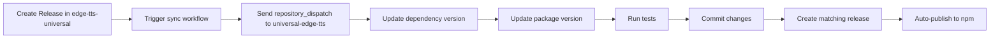

# Setup Guide for Cross-Repo Version Sync

This guide explains how to set up automatic version synchronization between `edge-tts-universal` and `universal-edge-tts`.

## 🔧 Setup Steps

### 1. Add Workflow to Main Repository

Copy the contents of `trigger-proxy-sync.yml` to your `edge-tts-universal` repository at:

```
edge-tts-universal/.github/workflows/sync-proxy-package.yml
```

### 2. Create Personal Access Token

1. Go to GitHub → Settings → Developer settings → Personal access tokens → Tokens (classic)
2. Click "Generate new token (classic)"
3. Give it a descriptive name like "Proxy Package Sync"
4. Select scopes:
   - `repo` (Full control of private repositories)
   - `workflow` (Update GitHub Action workflows)
5. Copy the generated token

### 3. Add Secret to Main Repository

1. Go to your `edge-tts-universal` repository
2. Settings → Secrets and variables → Actions
3. Click "New repository secret"
4. Name: `PROXY_REPO_TOKEN`
5. Value: Paste the personal access token from step 2

### 4. Test the Setup

#### Manual Test

1. Go to `edge-tts-universal` repository
2. Actions tab → "Sync Proxy Package Version" workflow
3. Click "Run workflow"
4. Enter a version like `1.0.1`
5. Run and verify it triggers the proxy repo

#### Automatic Test

1. Create a new release in `edge-tts-universal`
2. The proxy repo should automatically sync and create a matching release

## 🔄 How It Works



## 📋 Version Strategy

- **Main package** (`edge-tts-universal`): Controls the version numbers
- **Proxy package** (`universal-edge-tts`): Mirrors the main package version
- **Dependency**: Proxy package depends on `^{main_version}` of the main package
- **Tag format**: Uses semantic versioning without 'v' prefix (e.g., `1.2.3` not `v1.2.3`)

### Example Flow:

1. Release `edge-tts-universal` with tag `1.2.3` (no 'v' prefix)
2. Automatically triggers sync to `universal-edge-tts@1.2.3`
3. Updates dependency to `"edge-tts-universal": "^1.2.3"`
4. Creates release with tag `1.2.3` and publishes to npm

## 🛠️ Manual Sync (if needed)

If automatic sync fails, you can manually trigger it:

1. Go to `universal-edge-tts` repository
2. Actions → "Sync Version from Main Repo"
3. Run workflow with:
   - Version: The version to sync to (e.g., `1.2.3`)
   - Main repo version: The main package version (usually the same)

## 🔍 Troubleshooting

### Common Issues:

1. **Token expired**: Regenerate and update the `PROXY_REPO_TOKEN` secret
2. **Permission denied**: Ensure token has `repo` and `workflow` scopes
3. **Wrong repository name**: Verify the repository name in the workflow file
4. **Version format**: Ensure versions follow semantic versioning (x.y.z) without 'v' prefix
5. **Tag mismatch**: Both repos should use the same tag format (no 'v' prefix)
